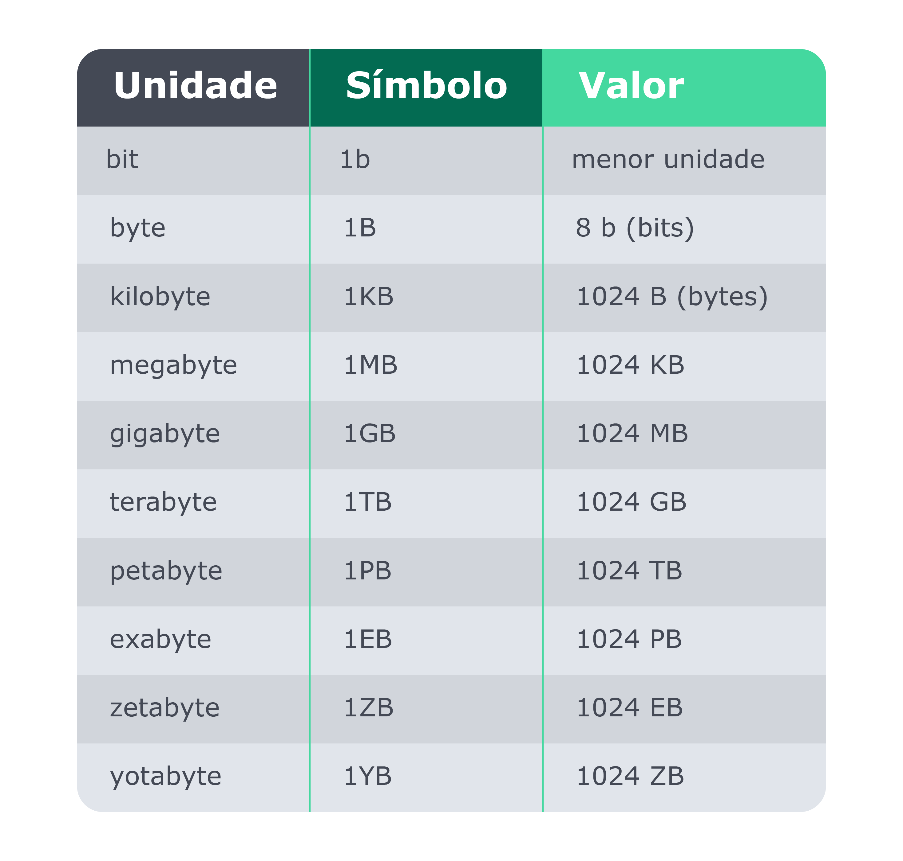

O sistema binário foi inventado pelo matemático alemão Gottfried Leibniz, no século 18.

Os computadores processam informações baseando-se no sistema binário com os que são chamados bits. Um bit é a menor unidade em um sistema digital e pode assumir o valor 0 ou 1 . Eletronicamente esse valor pode ser representado pela presença ou ausência de tensão ou corrente elétrica.

O bit, que é representado por um "b" (minúsculo) e o agrupamento de 8 bits correspondem à 1 byte, representado por um "B" (maiúsculo). 1 byte é capaz de armazenar um valor decimal entre 0 e 255 ( 0000 0000 e 1111 1111 ).

Em resumo:

Convencionalmente, a presença de tensão ou corrente elétrica pode ser considerada como verdadeiro, 1 , e a ausência como falso, 0 ;

Os dispositivos que podem se comportar como chaves eletrônicas, onde a tensão ou corrente na entrada resulta na presença ou ausência de uma tensão ou corrente na saída, são os transistores ;

Transistores podem ser agrupados de maneira a formarem as portas lógicas NOT, AND, OR, XOR, dentre outras. Estas portas lógicas apresentam, para uma mesma combinação de valores de entrada (conjunto de fios com ou sem tensão/corrente elétrica 0s e 1s), a mesma saída;

Portas lógicas podem formar circuitos de soma de bits. Daí temos adição, subtração, multiplicação, divisão, e assim sucessivamente, sempre seguindo a lógica binária.
